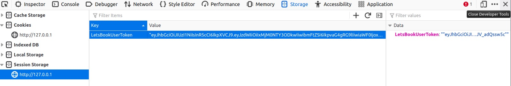

# Bookflix Micro-services

## Launch all services 
```
docker-compose up -d
```

## Check services state
```
docker-compose logs -f
```

## Stop all services
```
docker-compose stop
```

## Remove all containers (Services)
```
docker-compose down
```


# Exemples (if you want to test on Postman)

Check if `Books service` works
```
http://localhost
```

Check if `Notes service` works
```
http://localhost:8080
```

Check if `Comments service` works
```
http://localhost:5001/api
```

Check if `User auth service` works
```
http://localhost:5000/api
```


# Description

Welcome to LetsBook !

You can log in with any user registered. 
ex : 
    - email : test@test.com
    - password : password


LetsBook use JWT auth for user authentification !
The docker-front ask the docker-jwt-auth for authentification.


The docker-front save the token of the user in his web browser'SessionStorage.



The user is redirect to the home page.

Here you will see all the books we choose for you !


And the description of book looks like :


For more details of how to use each service, please check the README file present in each service.


